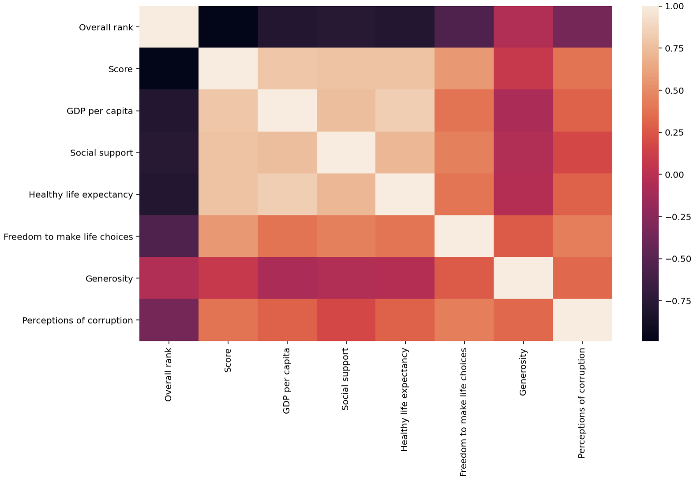

## Skill #4 - Data Visualization - Barplot 

In this example, I used data from the [World Happiness Report from Kaggle](https://www.kaggle.com/unsdsn/world-happiness)

I joined and presented happiness scores from the 5 happiest and saddest countries into the following barpolot.

Here, I join the happy and sad countries together:

```python
# Reading in the data
df = pd.read_csv('happy2019.csv')
# Subselecting the happiest and saddest countries
happy = df.head(5)
sad = df.tail(5)
data = happy.append(sad, ignore_index = True)
```
Here, I made a few modifications to the barplot so the countries' names are clearly legible. 

```python
#  Making a Bar Plot using Seaborn
barplot = sns.catplot(kind = 'bar', data = data, y = 'Score', x = 'Country or region')

# Modifying the X-Labels to avoid overlapping country names
plt.xticks(
    rotation = 45, 
    horizontalalignment = 'right',
    fontweight = 'light',
    fontsize = 'small'  
)
plt.show()
```


 Through learning to work with Seaborn, I am able to visually observe the correlations between the variables in the dataset using a correlation matrix. For example, I can see that there is a high positive correlation between 
```python
sns.heatmap(df.corr())
plt.show()
```


 
[Go to Skill #3](https://alretagealbader.github.io/RetagePortfolio/stripplot.html)

[Go to Skill #5](https://alretagealbader.github.io/RetagePortfolio/scatter.html)

[Go to Main Page](https://alretagealbader.github.io/RetagePortfolio/)

